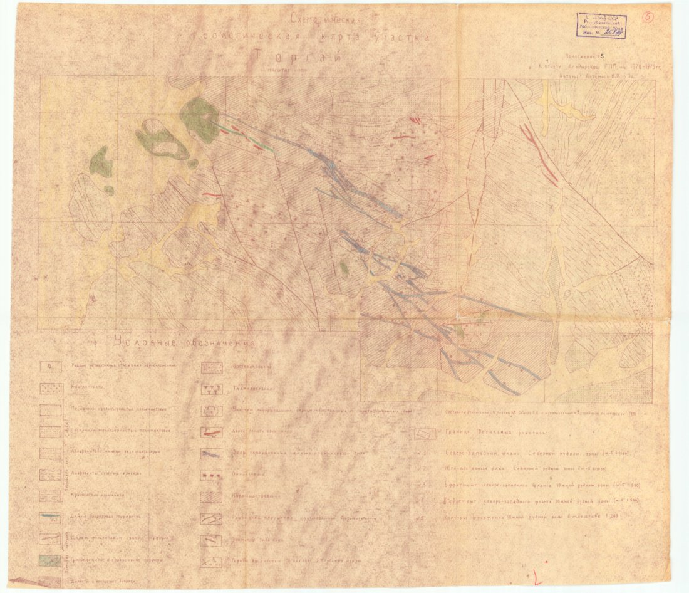
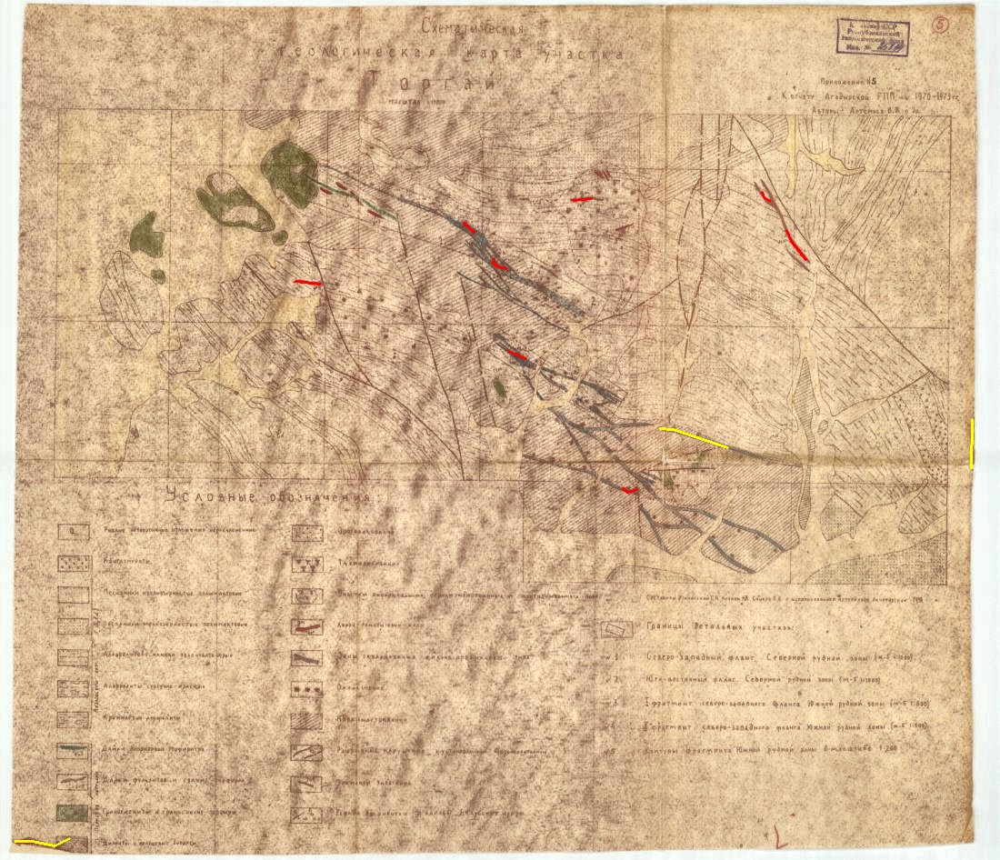
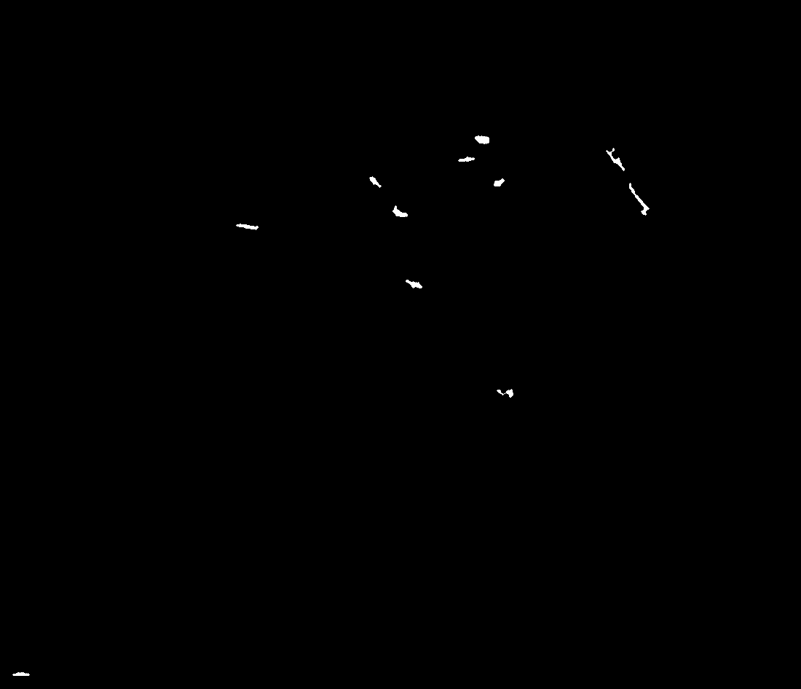

# Векторизация и геопривязка советских геологических карт — Трек 2

Автоматический пайплайн, который превращает отсканированные исторические
геологические карты (1970-е) в **векторные данные (GeoJSON + Shapefile)** и
**геопривязывает их к WGS84**. Извлекает линии разломов и границы геологических
слоёв классическим компьютерным зрением (OpenCV) **без обучения нейросетей**, строит
осевые линии скелетизацией и переводит координаты из датума **Пулково 1942 (EPSG:4284)
в WGS84 (EPSG:4326)** через pyproj.

> Хакатон «TerraSoviet Data Rescue», Трек 2 — «Векторизация и привязка карт».

Что делает пайплайн (коротко):
1. **Выделяет** объекты — цветным порогом в HSV (красные разломы, зелёные/синие границы)
   и «чёрной шляпой» по тёмным чернильным линиям.
2. **Векторизует** — утончает маски до осевых линий (скелетизация) и трассирует их в
   полилинии (а не обводит контуром-«петлёй»).
3. **Геопривязывает** — по углам рамки карты и заданной Area of Interest строит
   гомографию пиксель→Пулково 1942, затем pyproj переводит в WGS84.
4. **Честно отмечает** трудные карты (`low_confidence`) и карты без привязки
   (`georeferenced=no`) вместо падения.

---

## Идея подхода (коротко)

Карты выцветшие, со складками и карандашными пометками. Один универсальный
алгоритм не обработает идеально все карты, поэтому мы делаем **надёжно то, что
надёжно делается**, и честно отмечаем остальное:

1. **Цветные геологические карты** (красные/зелёные/синие линии на жёлтой бумаге) —
   наш сильный случай. Выделяем объекты **цветовым порогом в пространстве HSV**.
2. **Тёмные чернильные линии** (разломы/линеаменты не цветом, а карандашом/тушью) —
   выделяем операцией **black-hat** и оставляем только длинные тонкие компоненты.
3. **Серые кальки и выцветшие сканы** — слабый случай. Опора на тёмные линии и Canny,
   результат шумный, поэтому такие карты помечаются `low_confidence`.

Каждый этап обработки сохраняет промежуточную картинку в папку `debug/` —
это позволяет видеть глазами, что происходит на каждом шаге.

### Почему HSV

В пространстве **HSV** цвет раскладывается на тон (H), насыщенность (S) и яркость (V).
«Красная линия разлома» — это узкий диапазон тона H, который почти не зависит от того,
выцвела бумага или нет (выцветание сидит в основном в яркости V). Поэтому отбор
пикселей по диапазону HSV (`cv2.inRange`) — простой и устойчивый способ «вырезать по
цвету» цветные геологические линии. Красный тон в HSV «разорван» на концах круга,
поэтому для него используются два диапазона.

---

## Пример результата

Карта «Торгай» (цветная геологическая карта) — исходный скан и извлечённые
векторы разломов поверх него:

| Исходный скан | Найденные вектора |
|:---:|:---:|
|  |  |

Промежуточная бинарная маска красных разломов (после очистки), из которой строятся вектора:



Готовый геопривязанный выход лежит в `examples/example_original.geojson` (координаты
WGS84), а иллюстративный AOI для этой карты — в `examples/aoi/`. Воспроизвести один в один:

```bash
python main.py --input examples/maps --output output --aoi examples/aoi
```

> Картинки и GeoJSON в `examples/` сгенерированы **текущим** кодом, поэтому то, что
> видит судья при запуске, совпадает с показанным здесь. Охват AOI «Торгай» —
> приблизительный, для демонстрации перехода Пулково 1942 → WGS84.

Все промежуточные кадры каждого этапа сохраняются в `debug/<карта>/` при запуске.

---

## Установка

Требуется Python 3.9+ (проверено на 3.14).

```bash
git clone <repo-url>
cd tracktwo

python -m venv .venv
# Windows:
.venv\Scripts\activate
# Linux/macOS:
source .venv/bin/activate

pip install -r requirements.txt
```

Все зависимости ставятся колёсами (wheels) без GDAL/компиляции:
`opencv-python`, `numpy`, `pyproj` (датум), `scikit-image` (скелетизация),
`pyshp` (Shapefile, опц.), `pytest` (тесты). Если `scikit-image`/`pyshp` не встанут —
пайплайн не падает: вектора строятся контурным фолбэком, Shapefile просто не пишется.

---

## Запуск

Положите сканы карт в папку `input/` (можно во вложенных подпапках) и выполните:

```bash
python main.py
```

Программа найдёт все картинки, обработает каждую и запишет результаты в `output/`.

### Аргументы командной строки

| Аргумент | По умолчанию | Назначение |
|----------|--------------|------------|
| `--input`   | `input`        | папка со сканами (поиск рекурсивный, по подпапкам) |
| `--output`  | `output`       | куда писать GeoJSON и сводку |
| `--debug`   | `debug`        | куда писать промежуточные картинки |
| `--profile` | `geological`   | набор цветовых порогов: `geological` или `pencil` |
| `--aoi`     | —              | папка/файл с Area of Interest для геопривязки (пиксели → WGS84). Без него координаты пиксельные |
| `--no-debug`| —              | не сохранять промежуточные картинки (быстрее) |

Пример запуска на произвольной папке без правок кода:

```bash
python main.py --input "путь/к/сканам" --output output --profile geological --aoi aoi
```

**Никакого хардкода путей и имён файлов** — обрабатываются все картинки из указанной
папки, что позволяет запустить пайплайн на новом (скрытом) датасете без изменений.

---

## Что получается на выходе

В папке `output/`:

- `<имя_карты>.geojson` — для каждой карты. `FeatureCollection` из линий (`LineString`).
  В свойствах каждой линии: исходная карта, тип (`fault` / `fault_uncertain` /
  `boundary` / `edge`), цвет-источник и длина в пикселях. В `metadata` указано,
  геопривязана ли карта, исходный/целевой CRS и RMS-ошибка привязки.
- `<имя_карты>.shp` (+ `.dbf/.shx/.prj`) — тот же набор линий в Shapefile, если
  установлен `pyshp` (бонус-формат к GeoJSON).
- `_summary.csv` — сводный отчёт по всем картам: статус, уверенность (`ok` / `low`),
  число объектов, **`georeferenced`** (yes/no), **`crs`**, RMS привязки и причина
  пометки. Судья сразу видит, где результат надёжен, а где карта оказалась трудной.

### Координаты

- **С `--aoi`:** координаты в **WGS84 `[lon, lat]`** (`crs: EPSG:4326`). Переход датума
  **Пулково 1942 (EPSG:4284) → WGS84** выполняется через `pyproj` — без этого был бы
  сдвиг 100+ м (типичная ловушка с советскими картами).
- **Без `--aoi`** (или если рамка/AOI не распознаны): координаты **пиксельные**
  (x вправо, y вниз), `georeferenced=false` — честный фолбэк, лучше пиксели, чем
  привязка наугад.

### Формат AOI

`--aoi` — это папка с сайдкар-файлами по имени карты (`<имя_карты>.geojson` / `.txt`)
**или** один файл на весь датасет. Поддерживается:

- **GeoJSON** — полигон области (берётся внешнее кольцо/охват). CRS из поля `crs`
  (иначе считаем Пулково 1942).
- **TXT** — либо 4 строки `lon lat` (углы), либо одна строка `minlon minlat maxlon maxlat`
  (bbox). Необязательная первая строка `# epsg=4284` задаёт исходный CRS.

Если AOI задан в WGS84 — укажите `# epsg=4326` (или `crs` в GeoJSON), и переход датума
станет тождественным, но честным.

---

## Этапы пайплайна (и debug-картинки)

Для каждой карты в `debug/<имя_карты>/` сохраняется пронумерованная серия кадров —
их удобно листать по порядку, как комикс, и видеть, где что меняется:

| Кадр (по порядку) | Этап |
|------|------|
| `original`        | исходный скан |
| `resized`         | ужатый до рабочего размера |
| `clahe`           | усиленный контраст (CLAHE по яркости, цвета сохранены) |
| `denoised`        | серый + сглаживание |
| `mask_red/green/blue` | «сырые» цветовые маски (HSV-порог) |
| `mask_dark`       | тёмные чернильные линии (black-hat) |
| `canny`           | края (для карт без цвета) |
| `frame_mask`      | область внутри рамки карты (поля/легенда отсечены) |
| `mask_combined`   | объединённая маска |
| `clean_*`         | маски после очистки (морфология + фильтр формы) |
| `clean_combined`  | итоговая чистая маска |
| `vectors_overlay` | **осевые вектора поверх оригинала** — главная проверка качества |

Структура кода (`src/`): `preprocess.py` → `extract.py` → `cleanup.py` →
`vectorize.py` → `georef.py` → `export.py`, склейка в `pipeline.py`. Все настраиваемые
числа (пороги HSV/тёмных линий, размеры ядер, EPSG-коды) собраны в `src/config.py`.

---

## Ограничения (честно)

- **Цветовые пороги не универсальны.** Диапазоны HSV настроены под имеющиеся сканы и
  на другом датасете могут потребовать подстройки. Все пороги вынесены в `src/config.py`,
  есть профили (`--profile`), и пайплайн **не падает** на «непонятных» картах —
  помечает их `low_confidence`.
- **Тёмные линии на картах с рельефной штриховкой.** Black-hat ловит сильные
  чернильные линеаменты, но слабые тёмные разломы переплетены со штриховкой рельефа и
  ловятся неполно. Фильтр формы (`DARK_MIN_LENGTH` / `DARK_MAX_THICKNESS` в `config.py`)
  оставляет только длинные тонкие компоненты, отсекая буквы и заливки.
- **Кальки и серые чертежи** обрабатываются слабо: цвета нет, опора на тёмные линии и
  Canny, который ловит и складки. Такие карты честно помечаются `low`.
- **Геопривязка приближённая.** Привязка строится по углам рамки карты ↔ AOI (гомография
  4 точек). Если рамка детектится неточно или AOI задан грубым bbox — возможен сдвиг.
  RMS привязки пишется в метаданные; без рамки/AOI карта остаётся в пикселях
  (`georeferenced=no`), а не привязывается наугад.
- **Легенда/поля** отсекаются маской по рамке карты (`MASK_OUTSIDE_FRAME`), но если
  рамка не найдена — образцы легенды могут попасть в результат.

Это сознательный выбор стратегии: **лучше надёжно обработать понятный подтип карт и
честно отметить остальные, чем сломаться на всех.**

---

## Возможные улучшения

- Геопривязка по координатной сетке самой карты (OCR подписей градусной сетки) вместо
  опоры на AOI — точнее на картах с подписанной рамкой.
- Сшивание дальних сегментов одной линии (сейчас сшиваются только близкие).
- Разделение пересекающихся разломов на развилках скелета (сейчас ветка обрывается).
- Опционально — Segment Anything Model (SAM) для сегментации сложных карт.

---

## Тесты

```bash
python -m pytest
```

Быстрый end-to-end smoke-тест (`tests/test_smoke.py`): гоняет пайплайн на
`examples/example_original.jpg`, проверяет валидность GeoJSON, наличие сводки и
корректный фолбэк при отсутствии входной папки.
